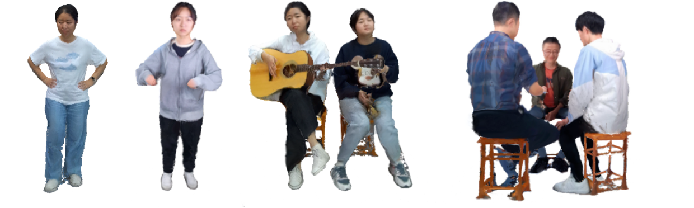
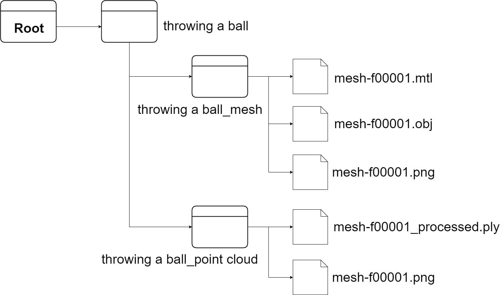

# PCVD - A Dataset of Point Cloud Video for Dynamic Human Interaction

This repository introduces PCVD (Point Cloud Video Dataset), which consists of synchronized point cloud video data captured using **six Azure Kinect cameras**. The dataset is designed for tasks such as denoising, segmentation, and motion recognition, providing high-quality data of dynamic human actions.

The dataset includes synchronized depth maps, RGB images, and 3D point clouds, captured from various human activities. It aims to serve as a valuable resource for 3D point cloud processing, especially in the context of dynamic human interaction.

## Dataset Example

Here is an example of how the point cloud looks:

## Features

- Captured with six synchronized Azure Kinect cameras in a 4m × 4m space.
- Relatively high-quality data of dynamic human actions, including a variety of movements from six volunteers.
- Includes synchronized depth maps, RGB images, and 3D point clouds in .obj and .ply formats.
- Optimized for tasks such as denoising, segmentation, and motion recognition.
- Demonstrates superior performance in terms of uniformity, completeness, robustness, and balanced frame distribution compared to other existing datasets.

## Dataset Structure

The dataset is organized into the following directories:

- mesh/: Contains 3D mesh files (e.g., `.obj`, `.mtl`) for each frame.
- point_cloud/: Contains point cloud files (e.g., `.ply`, `.png`) for each frame.

### Example Dataset Structure

The following diagram provides an example of the dataset structure:

- Root: The root folder contains the overall dataset directory.
- throwing a ball: A subfolder that contains the data for the "throwing a ball" sequence.
  - throwing a ball_mesh: Contains mesh-related files for the sequence.
    - mesh-f00001.mtl: Material properties for the mesh.
    - mesh-f00001.obj: The 3D mesh file.
    - mesh-f00001.png: Associated image for the mesh.
    - mesh-f00001_processed.ply: Processed point cloud data.
  - throwing a ball_point cloud: Contains point cloud data for the sequence.
    - mesh-f00001.png: Associated point cloud image.

## Dataset Evaluation

This dataset was carefully designed with the following key metrics in mind:

- Spatial-Color Consistency: The dataset ensures a high degree of spatial-color consistency across frames, reducing color inconsistencies.
- Missing Ratio: We ensure that the dataset minimizes missing data, resulting in fewer gaps in point cloud and depth map information.
- Shadow Ratio: The dataset is designed to minimize the presence of shadows, which can negatively impact point cloud quality.
- Average Frame Count: The dataset emphasizes balanced frame distribution across sequences, avoiding excessive variation in the number of frames.

## Contributions

We welcome contributions to this project. If you have suggestions, improvements, or issues, please feel free to open an issue.

